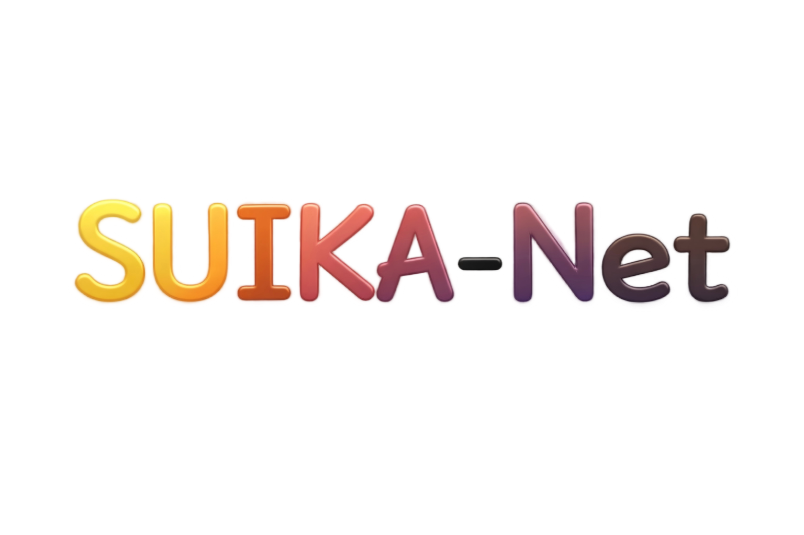
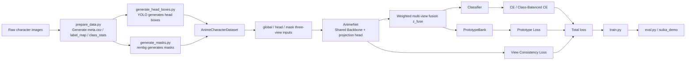

<p align="center">
  
</p>

<p align="center">
  
</p>

<p align="center">
  
  
  
  
  
</p>

---

## Project Overview

This repository is not just a collection of classification scripts. It is a complete experimental pipeline for anime character recognition:

- Data preparation: organize raw character-classified images into `meta.csv + label_map + class_stats`
- Three-view construction: generate `global`, `head`, and `mask-prompt` views for each image
- Model training: shared backbone, multi-view fusion, prototype bank, and class-balanced loss
- Model evaluation: closed-set Top-1 / Top-5 and open-set rejection
- Local demos:
  - `suika_demo`: loads local checkpoints for real inference
  - `mllm_demo`: a frontend demo page that calls Qwen/Bailian vision models

The goal of this project is very explicit: make the model focus on the character identity itself, rather than background, composition, local occlusion, or style-related statistical bias.

## Core Highlights

- `Three-view identity modeling`: the full image captures overall appearance, the head view captures key details, and the mask-prompt view suppresses background interference
- `Shared backbone`: all three views share one feature extractor, reducing parameters and improving training stability
- `Prototype Bank`: maintains class prototype vectors to strengthen intra-class compactness and inter-class separation
- `View Consistency Loss`: constrains different views of the same character to produce consistent semantics
- `Class-Balanced CE / Sampler`: more robust for long-tail categories
- `Open-set Rejection`: rejects unknown samples during evaluation using confidence and prototype similarity
- `Strict CUDA Pipeline`: head detection, mask generation, and demo inference are all designed around GPU-first execution

## Method Framework



## Repository Structure

```text
bs1_code_config_sanitized/
├─ configs/                 # Training, evaluation, and demo runtime configs
├─ datasets/                # Dataset definitions and image transforms
├─ losses/                  # Classification loss, view consistency loss, prototype loss
├─ models/                  # AnimeNet, MixStyle, PrototypeBank
├─ tools/                   # Weight download, head box generation, mask generation
├─ utils/                   # YAML, random seeds, metrics, samplers
├─ mllm_demo/               # Frontend demo for multimodal LLMs
├─ suika_demo/              # Local inference web demo
├─ prepare_data.py          # Data preparation entry point
├─ train.py                 # Training entry point
├─ eval.py                  # Evaluation entry point
├─ RUN_TRAINING.md          # Existing training workflow notes
└─ method.md                # Method design document
```

## Actual Method Design Reflected in Code

### 1. Data Layer: Three-View Inputs

`datasets/anime_dataset.py` defines `AnimeCharacterDataset`, which returns the following for each sample:

- `global`: the original full image
- `head`: the head crop extracted according to `head_boxes.json`
- `mask`: a mask-prompt view constructed by blending the foreground mask with a blurred background

Two important engineering details are built into this process:

- When `require_head_box=true`, missing head boxes raise an error immediately; this is intended for strict experimental mode
- When `require_mask=true`, missing masks raise an error immediately; this guarantees full three-view integrity

If strict mode is disabled:

- The head region falls back to an upper-body center crop
- The mask-prompt view falls back to a lightly blurred background image

### 2. Model Layer: Shared Backbone + Fusion Classification

`models/anime_net.py` defines `AnimeNet`, which creates the backbone through `timm.create_model(...)`. The default configuration is:

- `model.name: vit_base_patch16_224`
- `pretrained: true`
- `emb_dim: 512`

After encoding the three views separately, the model obtains:

- `z_global`
- `z_head`
- `z_mask`

These are then combined with weighted averaging according to `view_weights` to produce the fused representation `z_fuse`, which is then used by:

- `classifier` to output classification logits
- `prototype bank` to apply prototype similarity constraints

### 3. Loss Layer: Classification + Consistency + Prototype

In `losses/losses.py`, the total loss is defined as:

```text
total = cls_loss + lambda_view * view_loss + lambda_proto * proto_loss
```

It consists of:

- `cls_loss`: cross-entropy, optionally with class-balanced weights and label smoothing
- `view_loss`: pairwise cosine consistency constraints across the three views
- `proto_loss`: supervised classification loss over similarity to the prototype bank

### 4. Prototype Layer: Prototype Bank

`models/prototype_bank.py` uses EMA to continuously update the prototype of each class:

- Input: normalized fused features `z_fuse` from the current batch
- Update rule: average features within the same class, then blend them with the previous prototype using momentum
- Purpose: stabilize class centers and improve robustness in long-tail and style-varying scenarios

## Training Stage Design

`configs/base.yaml` splits training into three stages:

### `stage_a`

- Views: `global`
- `lambda_view = 0.0`
- `lambda_proto = 0.0`
- `use_prototype = false`

Purpose: establish the most basic baseline using single-view classification only.

### `stage_b`

- Views: `[global, head, mask]`
- `lambda_view = 0.2`
- `lambda_proto = 0.0`
- `use_prototype = false`

Purpose: verify whether three-view modeling and view consistency constraints are effective.

### `stage_c`

- Views: `[global, head, mask]`
- `lambda_view = 0.2`
- `lambda_proto = 0.5`
- `use_prototype = true`

Purpose: the full method configuration, and also the default training stage.

## Data Format

### `meta.csv`

`prepare_data.py` outputs the following fields:

| Field | Meaning |
| --- | --- |
| `image_id` | Sample ID |
| `file_path` | Image path, either relative to `data/` or absolute |
| `label` | Class ID |
| `label_name` | Character name |
| `anime_id` | Work title or work ID |
| `style_id` | Style-domain label |
| `split` | `train / val / test` |
| `rank` | Ranking or popularity index |
| `source_dir` | Original character folder name |
| `pixiv_id` | Source image ID |
| `pixiv_rank` | Original source ranking information |

### `label_map.json`

Stores the `label_id -> label_name` mapping. The demo loads it directly to display character names.

### `class_stats.json`

Stores:

- Total number of samples
- Number of classes
- Sample counts for each split
- Sample counts for each class

### `head_boxes.json`

Generated by `tools/generate_head_boxes.py`, with a typical structure like:

```json
{
  "images/01_xxx/a.jpg": {
    "x1": 12,
    "y1": 18,
    "x2": 201,
    "y2": 233,
    "conf": 0.97,
    "source_weight": "yolov8s.pt"
  }
}
```

### `data/masks/*.png`

Binary foreground masks generated by `tools/generate_masks.py`. The dataset uses them to build mask-prompt input images.

## Environment Dependencies

The full dependency list is recorded in `requirements_full.txt`. Core packages include:

- `torch==2.5.1+cu121`
- `torchvision==0.20.1+cu121`
- `timm>=1.0.22`
- `ultralytics>=8.4.37`
- `rembg>=2.0.69`
- `onnxruntime-gpu>=1.23.2`
- `opencv-python>=4.13.0`
- `PyYAML>=6.0.3`

### Environment Characteristics

Based on the code, this project is designed primarily for a `CUDA` environment:

- In `utils/io.py`, `device=auto` prefers CUDA by default
- `generate_head_boxes.py` automatically selects `cuda:0` by default
- `generate_masks.py` depends directly on `CUDAExecutionProvider`
- `suika_demo/server.py` explicitly rejects fallback to CPU in the demo path

If you are running formal experiments or preparing a demo, use a Python environment with CUDA support.

## Quick Start

### 1. Prepare Data

```bash
python prepare_data.py \
  --source-dir downloads/characters_top10_each500_single_medium \
  --output-root data \
  --max-per-class 500 \
  --train-ratio 0.8 \
  --no-val \
  --link-mode symlink
```

This step will:

- Enumerate each character folder
- Assign stable `label` values
- Write `meta.csv / label_map.json / class_stats.json`
- Create an empty `head_boxes.json` placeholder file

### 2. Download Weights

```bash
python tools/download_weights.py --output-root weights --require-cuda
```

This script will:

- Download YOLO head detection weights
- Download pretrained backbone files
- Prepare the `u2net` assets required by `rembg`
- Verify that `ultralytics / timm / onnxruntime-gpu` work correctly

### 3. Generate Head Boxes

```bash
python tools/generate_head_boxes.py \
  --csv-file data/meta.csv \
  --root data \
  --out-json data/head_boxes.json \
  --weights weights/head_detector/yolov8s.pt,weights/head_detector/yolov8n.pt \
  --strict
```

Script features:

- Supports ensembling multiple YOLO weights
- Supports multi-scale `imgsz-list`
- Enables horizontal-flip TTA by default
- In `strict` mode, any missed detection can terminate the process directly

### 4. Generate Masks

```bash
python tools/generate_masks.py \
  --csv-file data/meta.csv \
  --root data \
  --out-root data/masks \
  --u2net-home weights/rembg \
  --strict
```

Script features:

- Uses `rembg + onnxruntime-gpu`
- Outputs binarized masks
- Saves `masks_report.json`
- In `strict` mode, any failure can be treated as invalid experimental data

### 5. Train the Model

Full method:

```bash
python train.py --config configs/tuned_v3_top10x500_testselect.yaml
```

Baseline only:

```bash
python train.py --config configs/base.yaml --stage stage_a --output-dir outputs/stage_a
```

Three-view training without prototype:

```bash
python train.py --config configs/base.yaml --stage stage_b --output-dir outputs/stage_b
```

Dry-run check:

```bash
python train.py --config configs/base.yaml --dry-run
```

### 6. Evaluate the Model

```bash
python eval.py \
  --config configs/base.yaml \
  --checkpoint outputs/stage_c/best.pt \
  --split test \
  --save-preds outputs/stage_c/test_preds.csv
```

Disable open-set rejection:

```bash
python eval.py \
  --config configs/base.yaml \
  --checkpoint outputs/stage_c/best.pt \
  --split test \
  --disable-open-set
```

## Training Script Notes

The main flow of `train.py` is:

1. Read the YAML configuration
2. Apply command-line override arguments
3. Fix the random seed
4. Build the training and validation datasets
5. Initialize `AnimeNet`
6. Initialize `PrototypeBank` in `stage_c`
7. Build `AdamW + CosineAnnealingLR`
8. Train and validate by epoch
9. Save:
   - `latest.pt`
   - `best.pt`
   - `epoch_xxx.pt`
   - `history.jsonl`
   - `train_config.json`

### Supported Training Control Arguments

- `--stage`
- `--device`
- `--epochs`
- `--batch-size`
- `--num-workers`
- `--output-dir`
- `--resume`
- `--dry-run`
- `--max-steps`

## Evaluation Script Notes

In addition to standard closed-set classification metrics, `eval.py` also supports open-set decisions:

- `tau_prob`: threshold on maximum softmax probability
- `tau_sim`: threshold on maximum prototype similarity

If a sample fails both conditions, its prediction is set to `-1`, meaning unknown class.

### Output Metrics

- `closed_set_top1`
- `closed_set_top5`
- `open_set_accuracy`
- `open_set_unknown_rate`
- `num_samples`

### Prediction Export

If `--save-preds` is used, a CSV file will be generated containing:

- `file_path`
- `label`
- `pred`
- `pred_open`
- `conf`
- `sim`

## Configuration File Notes

The default configuration file is `configs/base.yaml`, which controls the following key sections:

### `data`

- Data root directory
- `meta.csv`
- Head box path
- Mask path
- Whether to strictly require head boxes / masks
- Number of dataloader workers

### `model`

- Backbone name
- Whether to use pretrained weights
- Image size
- Embedding dimension
- Dropout
- Whether to enable `MixStyle`
- Multi-view fusion weights

### `training`

- Current stage
- Number of epochs
- Batch size
- AMP
- Label smoothing
- Class-balanced CE
- Class-balanced sampler
- Logging frequency

### `loss`

- `lambda_view`
- `lambda_proto`
- `prototype_temperature`
- `prototype_momentum`

### `output`

- Output directory
- Latest checkpoint name
- Best checkpoint name

## Demo Notes

## `suika_demo`

This is the local full-inference demo that is closest to an actual project-results presentation.

### Features

- Upload one character image
- Execute on the backend in real time:
  - head detection
  - mask inference
  - three-view classification inference
- Return:
  - predicted character name
  - confidence score
  - prototype similarity
  - Top-K candidates
  - random gallery results from the same class

### Launch

```bash
python suika_demo/server.py --host 0.0.0.0 --port 8090
```

### Default API

- `POST /api/predict`
- `GET /api/gallery`
- `GET /api/image`
- `GET /api/health`

### Engineering Characteristics

- Loads local checkpoints directly without depending on external inference APIs
- Strictly depends on CUDA
- Performs warmup at startup by default to reduce first-request latency
- Can reproduce random gallery sampling results based on `seed + round`

## `mllm_demo`

This is a pure frontend multimodal demo page. After an image is uploaded, it calls a Qwen/Bailian vision model and returns a character profile card.

It is more oriented toward:

- Presentation pages
- Multimodal Q&A experience
- Supplementing the "system demonstration" aspect of a graduation project

It is not equivalent to the classifier trained in this project itself.

## Output Artifacts

After training, common outputs include:

- `outputs/<exp>/latest.pt`
- `outputs/<exp>/best.pt`
- `outputs/<exp>/epoch_XXX.pt`
- `outputs/<exp>/history.jsonl`
- `outputs/<exp>/train_config.json`

For evaluation:

- `outputs/<exp>/test_preds.csv`

For the tooling pipeline:

- `data/head_boxes_report.json`
- `data/masks_report.json`
- `weights/weights_manifest.json`

## FAQ

### 1. Why do many scripts not fall back to CPU by default?

Because many parts of this repository are designed at the code level for a GPU-based experimental environment, especially:

- YOLO head detection
- `rembg` with onnxruntime CUDA inference
- Online inference in `suika_demo`

This is not a bug. It is a project constraint.

### 2. How should `require_head_box` and `require_mask` be chosen?

- For formal experiments: use strict mode to guarantee data quality
- For debugging or sample demos: you can relax the setting temporarily and allow fallback behavior

### 3. What is the difference between `mllm_demo` and `suika_demo`?

- `mllm_demo`: uses an external multimodal model and is presentation-oriented
- `suika_demo`: uses the local model for real inference and is result-oriented

### 4. Why are there multiple `tuned_*.yaml` files?

These usually represent different experiment batches, class scales, sample counts, random seeds, or test-set selection strategies, and are part of the graduation project's experiment records.
