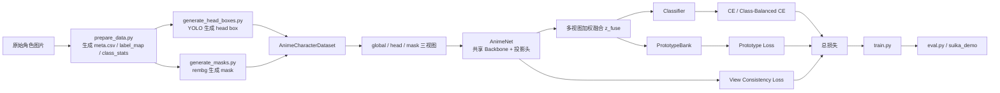

<p align="center">
  
</p>

<p align="center">
  
</p>

<p align="center">
  一个面向毕业设计场景的动漫角色识别项目：以 <code>PyTorch + timm + YOLO + rembg</code> 为核心，实现 <code>global / head / mask</code> 三视图身份建模、原型学习、长尾友好训练，以及本地可演示的前后端 Demo。
</p>

<p align="center">
  
  
  
  
  
</p>

---

## 项目概览

这个仓库不是单纯的分类脚本集合，而是一条完整的动漫角色识别实验链路：

- 数据整理：把按角色分类的原始图片整理为 `meta.csv + label_map + class_stats`
- 三视图构建：为每张图生成 `global`、`head`、`mask-prompt`
- 模型训练：共享骨干网络、多视图融合、prototype bank、类平衡损失
- 模型评估：闭集 Top-1 / Top-5 与开放集拒识
- 本地演示：
  - `suika_demo`：加载本地 checkpoint 做真实推理
  - `mllm_demo`：调用 Qwen/Bailian 视觉模型的前端展示页

项目目标非常明确：让模型更关注“角色身份”本身，而不是背景、构图、局部遮挡或画风统计偏差。

## 核心亮点

- `三视图身份建模`：全图看整体外观，头部看关键细节，mask-prompt 弱化背景干扰
- `共享 backbone`：三个视图共用一套特征提取器，参数更省、训练更稳
- `Prototype Bank`：维护类别原型向量，增强类内聚合与类别区分
- `View Consistency Loss`：约束不同视图对同一角色输出一致语义
- `Class-Balanced CE / Sampler`：对长尾类别更友好
- `Open-set Rejection`：评估时可基于置信度与原型相似度拒识未知样本
- `Strict CUDA Pipeline`：头部检测、掩码生成、Demo 推理都优先按 GPU 流程设计

## 方法框架



## 仓库结构

```text
bs1_code_config_sanitized/
├─ configs/                 # 训练、评估、Demo 运行配置
├─ datasets/                # 数据集定义与图像变换
├─ losses/                  # 分类损失、视图一致性损失、原型损失
├─ models/                  # AnimeNet、MixStyle、PrototypeBank
├─ tools/                   # 权重下载、head box 生成、mask 生成
├─ utils/                   # YAML、随机种子、指标、采样器
├─ mllm_demo/               # 多模态大模型前端演示
├─ suika_demo/              # 本地推理 Web Demo
├─ prepare_data.py          # 数据整理入口
├─ train.py                 # 训练入口
├─ eval.py                  # 评估入口
├─ RUN_TRAINING.md          # 已有训练流程说明
└─ method.md                # 方法设计文档
```

## 代码对应的真实方法设计

### 1. 数据层：三视图输入

`datasets/anime_dataset.py` 中的 `AnimeCharacterDataset` 会为每个样本返回：

- `global`：原始整图
- `head`：依据 `head_boxes.json` 裁出的头部区域
- `mask`：由前景 mask 与模糊背景混合得到的 mask-prompt 视图

其中有两个重要工程细节：

- `require_head_box=true` 时，缺少 head box 会直接报错；为严格实验模式
- `require_mask=true` 时，缺少 mask 会直接报错；保证三视图完整性

如果关闭严格模式：

- 头部区域会退化成上半身中心裁剪
- mask-prompt 会退化成轻度模糊背景图

### 2. 模型层：共享骨干 + 融合分类

`models/anime_net.py` 中的 `AnimeNet` 使用 `timm.create_model(...)` 创建 backbone，默认配置为：

- `model.name: vit_base_patch16_224`
- `pretrained: true`
- `emb_dim: 512`

三个视图分别编码后会得到：

- `z_global`
- `z_head`
- `z_mask`

随后按 `view_weights` 做加权平均，得到融合表示 `z_fuse`，再进入：

- `classifier` 输出分类 logits
- `prototype bank` 做原型相似度约束

### 3. 损失层：分类 + 一致性 + 原型

`losses/losses.py` 里总损失形式为：

```text
total = cls_loss + lambda_view * view_loss + lambda_proto * proto_loss
```

组成如下：

- `cls_loss`：交叉熵，可带类平衡权重与 label smoothing
- `view_loss`：三视图两两余弦一致性约束
- `proto_loss`：与原型库相似度上的监督分类损失

### 4. 原型层：Prototype Bank

`models/prototype_bank.py` 使用 EMA 方式持续更新每个类别的 prototype：

- 输入：当前 batch 的归一化融合特征 `z_fuse`
- 更新：对同类特征求均值，再与旧 prototype 做动量融合
- 作用：增强类别中心稳定性，改善长尾与风格波动场景

## 训练阶段设计

`configs/base.yaml` 把训练拆成 3 个阶段：

### `stage_a`

- 视图：`[global]`
- `lambda_view = 0.0`
- `lambda_proto = 0.0`
- `use_prototype = false`

用途：建立最基础 baseline，只做单视图分类。

### `stage_b`

- 视图：`[global, head, mask]`
- `lambda_view = 0.2`
- `lambda_proto = 0.0`
- `use_prototype = false`

用途：验证三视图建模与视图一致性约束是否有效。

### `stage_c`

- 视图：`[global, head, mask]`
- `lambda_view = 0.2`
- `lambda_proto = 0.5`
- `use_prototype = true`

用途：完整方法版本，也是默认训练阶段。

## 数据格式说明

### `meta.csv`

`prepare_data.py` 会输出如下字段：

| 字段 | 含义 |
| --- | --- |
| `image_id` | 样本编号 |
| `file_path` | 图片路径，相对 `data/` 或绝对路径 |
| `label` | 类别 ID |
| `label_name` | 角色名 |
| `anime_id` | 作品名或作品 ID |
| `style_id` | 画风域标签 |
| `split` | `train / val / test` |
| `rank` | 排序或热度编号 |
| `source_dir` | 原始角色文件夹名 |
| `pixiv_id` | 来源图片 ID |
| `pixiv_rank` | 原始来源排名信息 |

### `label_map.json`

保存 `label_id -> label_name` 映射，Demo 会直接加载它展示角色名称。

### `class_stats.json`

保存：

- 样本总数
- 类别数
- 各 split 样本数
- 各类别样本数

### `head_boxes.json`

由 `tools/generate_head_boxes.py` 生成，典型结构：

```json
{
  "images/01_xxx/a.jpg": {
    "x1": 12,
    "y1": 18,
    "x2": 201,
    "y2": 233,
    "conf": 0.97,
    "source_weight": "yolov8s.pt"
  }
}
```

### `data/masks/*.png`

由 `tools/generate_masks.py` 生成的二值前景 mask。数据集会用它构造 mask-prompt 输入图。

## 环境依赖

代码库的完整依赖记录在 `requirements_full.txt`，核心项包括：

- `torch==2.5.1+cu121`
- `torchvision==0.20.1+cu121`
- `timm>=1.0.22`
- `ultralytics>=8.4.37`
- `rembg>=2.0.69`
- `onnxruntime-gpu>=1.23.2`
- `opencv-python>=4.13.0`
- `PyYAML>=6.0.3`

### 环境特征

从代码实现看，这个项目默认面向 `CUDA` 环境：

- `utils/io.py` 中 `device=auto` 会优先要求 CUDA
- `generate_head_boxes.py` 默认自动选 `cuda:0`
- `generate_masks.py` 强依赖 `CUDAExecutionProvider`
- `suika_demo/server.py` 在 Demo 场景下明确拒绝退回 CPU

如果你要做正式实验或展示，建议直接在支持 CUDA 的 Python 环境中运行。

## 快速开始

### 1. 准备数据

```bash
python prepare_data.py \
  --source-dir downloads/characters_top10_each500_single_medium \
  --output-root data \
  --max-per-class 500 \
  --train-ratio 0.8 \
  --no-val \
  --link-mode symlink
```

该步骤会：

- 枚举每个角色文件夹
- 分配稳定的 `label`
- 写出 `meta.csv / label_map.json / class_stats.json`
- 创建空的 `head_boxes.json` 占位文件

### 2. 下载权重

```bash
python tools/download_weights.py --output-root weights --require-cuda
```

这个脚本会：

- 下载 YOLO 头部检测权重
- 下载 backbone 预训练文件
- 准备 `rembg` 所需 `u2net`
- 验证 `ultralytics / timm / onnxruntime-gpu` 是否可正常工作

### 3. 生成 head box

```bash
python tools/generate_head_boxes.py \
  --csv-file data/meta.csv \
  --root data \
  --out-json data/head_boxes.json \
  --weights weights/head_detector/yolov8s.pt,weights/head_detector/yolov8n.pt \
  --strict
```

脚本特点：

- 支持多个 YOLO 权重集成
- 支持多尺度 `imgsz-list`
- 默认启用水平翻转 TTA
- `strict` 下任何漏检都可直接终止流程

### 4. 生成 mask

```bash
python tools/generate_masks.py \
  --csv-file data/meta.csv \
  --root data \
  --out-root data/masks \
  --u2net-home weights/rembg \
  --strict
```

脚本特点：

- 使用 `rembg + onnxruntime-gpu`
- 输出二值化 mask
- 会保存 `masks_report.json`
- `strict` 下任何失败都可以视为实验数据不合格

### 5. 训练模型

完整方法：

```bash
python train.py --config configs/tuned_v3_top10x500_testselect.yaml
```

只跑 baseline：

```bash
python train.py --config configs/base.yaml --stage stage_a --output-dir outputs/stage_a
```

三视图但无 prototype：

```bash
python train.py --config configs/base.yaml --stage stage_b --output-dir outputs/stage_b
```

干跑检查：

```bash
python train.py --config configs/base.yaml --dry-run
```

### 6. 评估模型

```bash
python eval.py \
  --config configs/base.yaml \
  --checkpoint outputs/stage_c/best.pt \
  --split test \
  --save-preds outputs/stage_c/test_preds.csv
```

关闭开放集拒识：

```bash
python eval.py \
  --config configs/base.yaml \
  --checkpoint outputs/stage_c/best.pt \
  --split test \
  --disable-open-set
```

## 训练脚本说明

`train.py` 的主流程如下：

1. 读取 YAML 配置
2. 应用命令行覆盖参数
3. 固定随机种子
4. 构建训练集和验证集
5. 初始化 `AnimeNet`
6. 在 `stage_c` 中初始化 `PrototypeBank`
7. 构建 `AdamW + CosineAnnealingLR`
8. 按 epoch 训练与验证
9. 保存：
   - `latest.pt`
   - `best.pt`
   - `epoch_xxx.pt`
   - `history.jsonl`
   - `train_config.json`

### 支持的训练控制参数

- `--stage`
- `--device`
- `--epochs`
- `--batch-size`
- `--num-workers`
- `--output-dir`
- `--resume`
- `--dry-run`
- `--max-steps`

## 评估脚本说明

`eval.py` 除了常规闭集分类指标外，还支持开放集判断：

- `tau_prob`：softmax 最大概率阈值
- `tau_sim`：prototype 最大相似度阈值

如果样本同时不满足这些条件，就会把预测标为 `-1`，表示未知类。

### 输出指标

- `closed_set_top1`
- `closed_set_top5`
- `open_set_accuracy`
- `open_set_unknown_rate`
- `num_samples`

### 预测结果导出

如果使用 `--save-preds`，会生成 CSV，包含：

- `file_path`
- `label`
- `pred`
- `pred_open`
- `conf`
- `sim`

## 配置文件说明

默认配置文件是 `configs/base.yaml`，可以控制以下关键部分：

### `data`

- 数据根目录
- `meta.csv`
- head box 路径
- mask 路径
- 是否强制要求 head box / mask
- dataloader worker 数

### `model`

- backbone 名称
- 是否使用预训练
- 图像尺寸
- embedding 维度
- dropout
- 是否启用 `MixStyle`
- 多视图融合权重

### `training`

- 当前 stage
- epoch 数
- batch size
- AMP
- label smoothing
- 类平衡 CE
- 类平衡 sampler
- 日志输出频率

### `loss`

- `lambda_view`
- `lambda_proto`
- `prototype_temperature`
- `prototype_momentum`

### `output`

- 输出目录
- 最新 checkpoint 名称
- 最优 checkpoint 名称

## Demo 说明

## `suika_demo`

这是最贴近“项目成果展示”的本地完整推理 Demo。

### 功能

- 上传一张角色图
- 后端实时执行：
  - head detection
  - mask inference
  - 三视图分类推理
- 返回：
  - 预测角色名
  - 置信度
  - prototype 相似度
  - Top-K 候选
  - 同类别随机图库结果

### 启动方式

```bash
python suika_demo/server.py --host 0.0.0.0 --port 8090
```

### 默认 API

- `POST /api/predict`
- `GET /api/gallery`
- `GET /api/image`
- `GET /api/health`

### 工程特点

- 直接加载本地 checkpoint，不依赖外部推理 API
- 强依赖 CUDA
- 启动时默认 warmup，降低首请求延迟
- 可根据 `seed + round` 复现图廊随机采样结果

## `mllm_demo`

这是一个纯前端多模态演示页，上传图片后调用 Qwen/Bailian 的视觉模型返回角色资料卡。

它更偏向：

- 展示型页面
- 多模态问答体验
- 补充毕业设计“系统展示感”

它不等价于本项目训练出的分类器本身。

## 输出产物说明

训练完成后，常见输出包括：

- `outputs/<exp>/latest.pt`
- `outputs/<exp>/best.pt`
- `outputs/<exp>/epoch_XXX.pt`
- `outputs/<exp>/history.jsonl`
- `outputs/<exp>/train_config.json`

如果是评估：

- `outputs/<exp>/test_preds.csv`

如果是工具链：

- `data/head_boxes_report.json`
- `data/masks_report.json`
- `weights/weights_manifest.json`

## 常见问题

### 1. 为什么很多脚本默认不回退 CPU？

因为这个仓库的很多流程在代码层面就是按 GPU 实验环境设计的，尤其是：

- YOLO 头部检测
- rembg 的 onnxruntime CUDA 推理
- suika_demo 的在线推理

这不是 bug，而是项目约束。

### 2. `require_head_box` 和 `require_mask` 应该怎么选？

- 做正式实验：建议严格模式，保证数据质量
- 做调试或样例展示：可以临时放宽，允许 fallback

### 3. `mllm_demo` 和 `suika_demo` 有什么区别？

- `mllm_demo`：外部大模型分析，偏展示
- `suika_demo`：本地模型真实推理，偏项目成果

### 4. 为什么会有多个 `tuned_*.yaml`？

这些通常代表不同实验批次、类别规模、样本数量、随机种子或测试集选择策略，是毕业设计实验记录的一部分。
